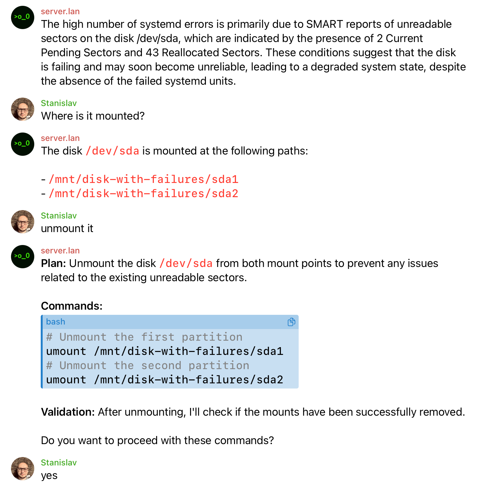

# Server Agent

Telegram-based Home Server Agent (PoC) - reliable and maintainable bot for server management.

## Features

- **Telegram Control**: Receive commands and send notifications
- **Tools**: Execute terminal commands via AI
- **Health Checks**: Periodically monitor server health and send notifications if issues are
  detected

## Screenshots



## Quick Start

```bash
# Run checks(formatting, linting, tests)
./run check

# Install dependencies and start application
./run start

# Compile and run on server and start
./run deploy server.lan:~/server-ai
```

## Configuration

Set environment variables:

### Required

- `TELEGRAM_BOT_TOKEN` - Telegram bot token from [@BotFather](https://t.me/botfather)
- `TELEGRAM_OWNER_IDS` - allowed Telegram user IDs (comma-separated list of numbers)
- `AGENT_LLM_API_KEY` - OpenAI API key for LLM functionality

### Optional

- `AGENT_DATA_DIR` - directory for storing data files (default: "./data")
- `LOGGING_FORMAT` - log output format: "pretty" or "json" (default: "pretty")
- `AGENT_MEMORY_MAX_SYMBOLS` - maximum total symbols to store in conversation history (default: 20000)
- `AGENT_TOOLS_TIMEOUT_MS` - timeout for tool execution in milliseconds (default: 30000)
- `AGENT_TOOLS_MAX_OUTPUT_BYTES` - maximum output size for tools in bytes (default: 200000)
- `AGENT_LLM_ADDITIONAL_PROMPT` - additional custom instructions for LLM system prompt
- `RATE_LIMIT_REQUEST_INTERVAL_MS` - minimum interval between user requests in milliseconds
  (default: 5000)
- `SCHEDULER_INTERVAL_HOURS` - hours between health checks (default: 1)
- `SCHEDULER_JITTER_MINUTES` - random jitter for check timing in minutes (default: 5)

## Bot Commands

- `/reset` - reset history

## Architecture

- **Deno runtime** for reliability and security
- **TypeScript strict mode** with domain-organized configuration
- **grammy** for Telegram Bot API
- **zod** for data validation
- **Vercel AI SDK** for LLM integration with tool calls
- **File storage** for simplicity (JSONL)
- **AbortController-based timeouts** for terminal tool execution

## Documentation

- [Requirements](documents/requirements.md) - Software Requirements Specification
- [Design](documents/design.md) - Software Design Specification
