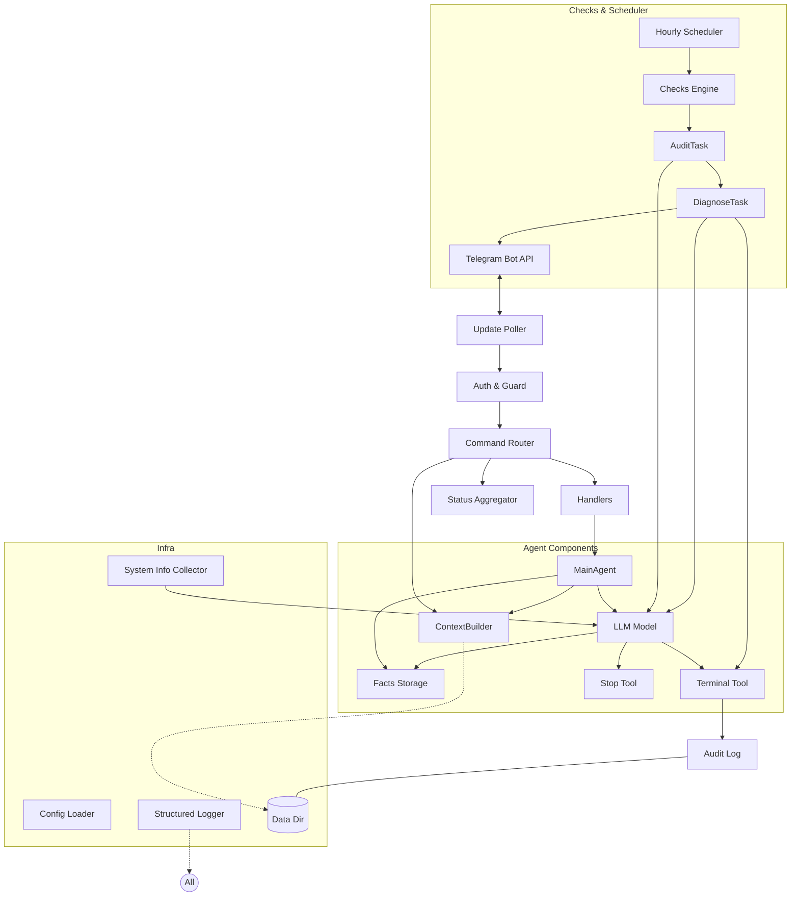
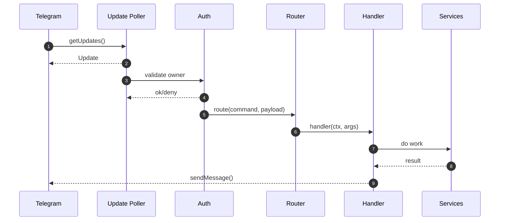
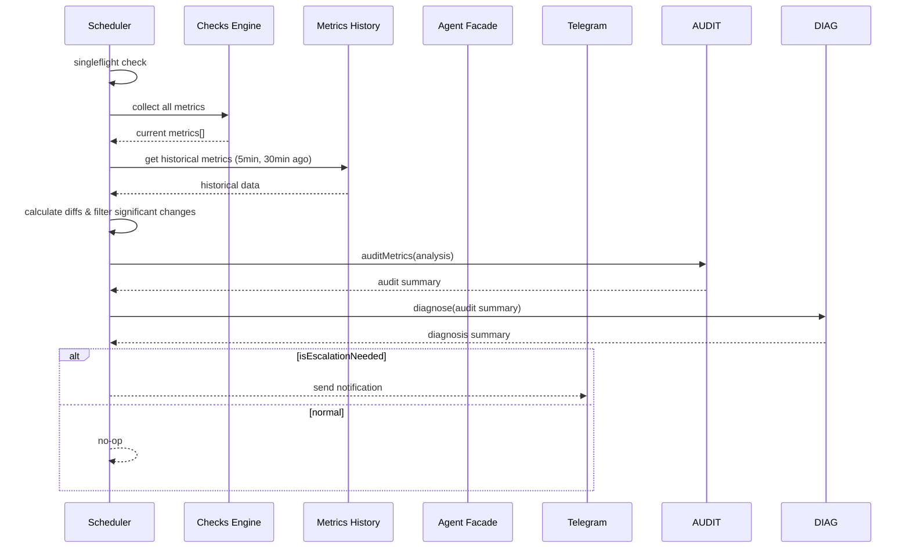
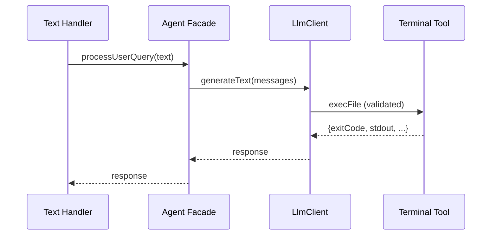
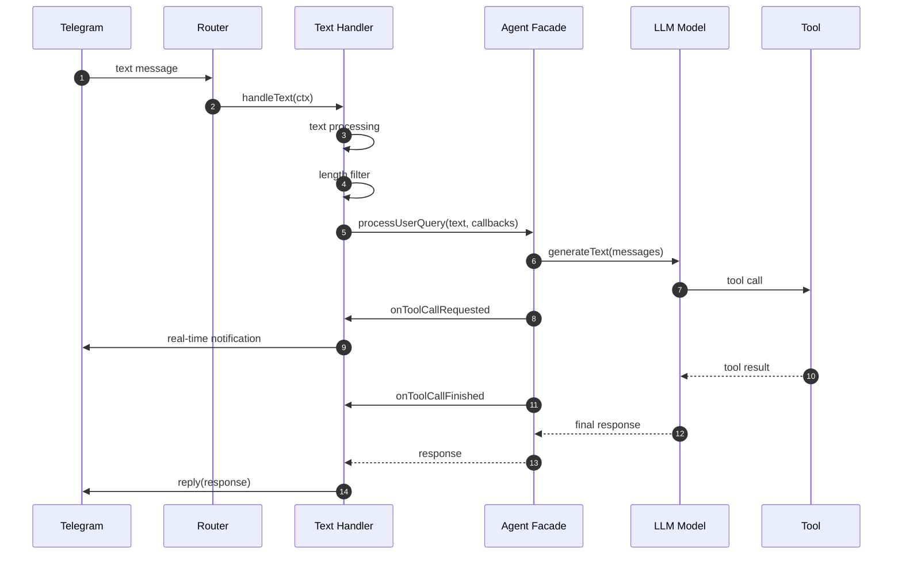
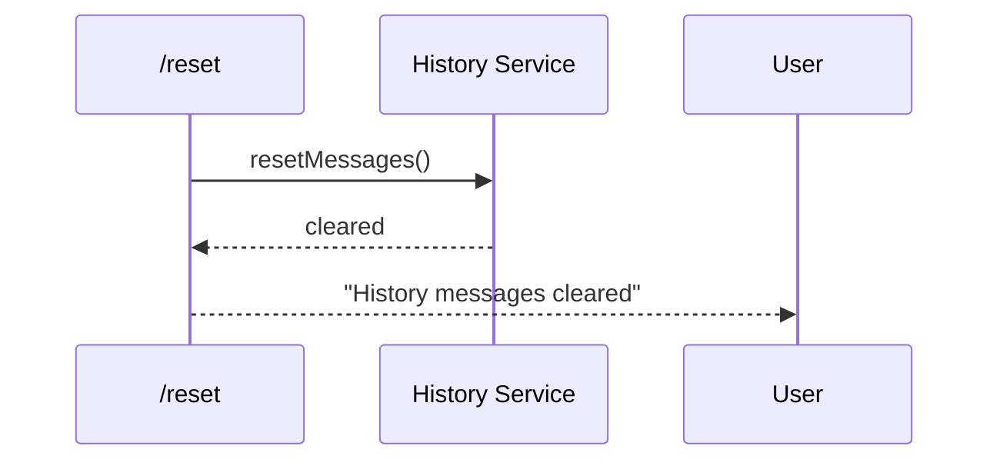
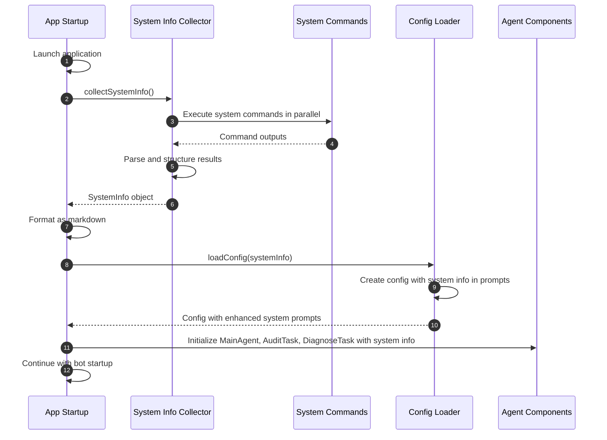

# Software Design Specification (SDS)

**Project:** Telegram Home Server Agent (TypeScript) **Stage:** PoC **Version:** 1.0 **Date:**
2025-09-23 **Author:** Tech/Infra

## 0. Purpose & SRS Relation

SDS details PoC architecture/design per SRS. Provides implementation plan for bot + scheduler + LLM
adapter service on home server with Telegram interface.

PoC scope: long polling, single owner, file-based state, terminal tool LLM-only via Responses API.

## 1. Architecture Overview

### 1.1. Component Diagram



### 1.2. Main Flows

- **Startup:** App launch → System Info Collector → system information → Facts Storage init → LLM
  system prompts.
- **User Interaction:** Telegram → long polling → auth → routing → handlers →
  MainAgent.processUserQuery → responses.
- **Self-checks:** Scheduler (~hour + jitter) → Checks Engine → AuditTask.auditMetrics →
  DiagnoseTask.diagnose → Telegram notification.
- **LLM Tools:** MainAgent/AuditTask/DiagnoseTask → Vercel AI SDK → Terminal/Stop tools → results.
  DiagnoseTask uses Terminal tool for investigation.

## 2. Technology Stack

- **Runtime:** Deno ≥1.45
- **Language:** TypeScript strict mode; no `any`
- **Telegram SDK:** `grammy` (Deno-compatible)
- **Schema validation:** `zod`
- **Logging:** console JSON logger
- **Testing:** `Deno.test` co-located (*.test.ts)
- **Correlation ID:** custom timestamp-based generator (base64-encoded)
- **Processes:** `Deno.Command` (no shell/TTY)
- **LLM:** Vercel AI SDK (`ai`) with any compatible model (e.g., OpenAI gpt-4o-mini, Claude, etc.);
  Experimental_Agent for tool orchestration

> In PoC we avoid network dependencies except Telegram. No external databases/metrics/secret
> managers.

---

## 3. Deployment & Environment

### 3.1. Environment Variables

- **Required:**
  - `TELEGRAM_BOT_TOKEN: string`
  - `TELEGRAM_OWNER_IDS: string` (CSV numeric IDs)
  - `AGENT_LLM_API_KEY: string` (OpenAI)
- **Optional:**
  - `AGENT_DATA_DIR: string` (default `./data`)
  - `LOGGING_FORMAT: string` (default "pretty", or "json")
  - `AGENT_MEMORY_MAX_SYMBOLS: number` (default 20000)
  - `AGENT_TERMINAL_TIMEOUT_MS: number` (default 30_000)
  - `AGENT_TERMINAL_MAX_COMMAND_OUTPUT_SIZE: number` (default 200_000)
  - `AGENT_TERMINAL_MAX_LLM_INPUT_LENGTH: number` (default 2000)
  - `AGENT_LLM_PRICE_INPUT_TOKENS: number` (default 0.15) - price per 1M input tokens in USD
  - `AGENT_LLM_PRICE_OUTPUT_TOKENS: number` (default 0.60) - price per 1M output tokens in USD
  - `AGENT_LLM_PRICE_TOTAL_TOKENS: number` (optional) - price per 1M total tokens in USD
  - `AGENT_LLM_PRICE_REASONING_TOKENS: number` (optional) - price per 1M reasoning tokens in USD
  - `AGENT_LLM_PRICE_CACHED_INPUT_TOKENS: number` (optional) - price per 1M cached input tokens in
    USD
  - `SCHEDULER_INTERVAL_HOURS: number` (default 1)
  - `SCHEDULER_JITTER_MINUTES: number` (default 5)
  - `AGENT_METRICS_HISTORY_HOURS: number` (default 1) - how long to keep metrics history
  - `AGENT_METRICS_CHANGE_THRESHOLD: number` (default 10) - percentage threshold for significant
    changes
- **Caching:** `loadConfig()` caches parsed configuration; no repeated parsing
- **Domain Structure:** Configuration organized into domain objects (agent, telegram, logging,
  scheduler, metrics)

### 3.1.1. Configuration Structure

Configuration is organized into domain-specific objects for better maintainability:

```typescript
interface Config {
  agent: {
    dataDir: string;
    history: { maxMessages: number };
    terminal: { timeoutMs: number; maxCommandOutputSize: number; maxLLMInputLength: number };
    metrics: { historyHours: number; changeThreshold: number };
    llm: {
      provider: string;
      apiKey: string;
      model: string;
      maxSteps: number;
      maxStdoutLength: number;
      basePrompt: string;
      additionalPrompt: string;
      systemInfo?: string;
      metricsAnalysisPrompt: string;
      tokenPrices: {
        inputTokens: number;
        outputTokens: number;
        totalTokens?: number;
        reasoningTokens?: number;
        cachedInputTokens?: number;
      };
    };
  };
  telegram: { botToken: string; ownerIds: readonly number[] };
  logging: { format: "pretty" | "json" };
  scheduler: { intervalHours: number; jitterMinutes: number };
}
```

Constants are centralized in `createDefaultConfig()` and environment variables overlay defaults.

The `systemPrompt` defines the LLM's role as home server agent with terminal tool access for system
tasks. Rich text formatting uses `markdownToTelegramHTML` converter.

### 3.3. File Hierarchy

```
<data_dir>/                 # Configured but not used in PoC (in-history storage only)
```

### 3.4. Service

- Run under restricted OS user, minimal privileges.
- Optional `systemd` unit (Appendix A).
- Launch: `deno run -A --unstable main.ts`

---

## 4. Subsystems & Detailed Design

### 4.1. Update Poller

- Uses `grammy` polling mode.
- Offset management: SDK handles polling offsets automatically.
- Network errors: exponential backoff (1–30 sec).

### 4.2. Auth & Guard

- Extract `from.id` per Update, compare with `OWNER_TELEGRAM_IDS`.
- Unauthorized: safe message (no details).
- All events logged: `update_id`, `chat_id`, `message_id`, `correlation_id`.

### 4.3. Command Router

- Declarative registry: `name`, `description`, `argsSchema(zod)`, `handler`.
- Commands:
  - `/reset`: clear conversation history
- No other commands. Text without `/` → LLM query; `/reset` command normal.
- Text messages: auto-processed, messages <2 chars filtered.

**Example schema:**

```ts
interface CommandDef<A> {
  name: string;
  desc: string;
  args: z.ZodType<A>;
  handler: (ctx: Ctx, args: A) => Promise<void>;
}
```

- **Text Message Handler:** Processes any text message without `/` prefix as LLM query.
  - Filters out messages shorter than 2 characters
  - Logs all messages sent to LLM for monitoring

### 4.4. Handlers Layer

- Thin wrappers, logic in services (Context, Status, Scheduler).
- Text messages: auto LLM processing via `processUserQuery`.
- All responses fit in 1–2 messages; long outputs summarized.

### 4.5. Context Builder

- **Purpose:** Build recent `ModelMessage[]` within symbol budget and render system prompt from
  template with system info and facts.
- **Storage:** In-memory ModelMessage[] array with chronological order.
- **Limits:** `AGENT_MEMORY_MAX_SYMBOLS` — symbol-based trimming from head.
- **Behavior:**
  - `append()` adds messages directly (system, user, assistant, tool).
  - `appendStepMessages()` adds messages from LLM step responses with deduplication by content hash.
  - `getContext()` returns `{systemPrompt, messages}` with recent context within symbol budget.
  - System prompt generated from template with placeholders `{{SERVER_INFO}}`, `{{FACTS}}`.
  - `reset()` clears context.

### 4.6. Scheduler + Singleflight

- Scheduler every ~60 min + jitter ±5 min:

```ts
const base = 60 * 60 * 1000;
const jitter = rand(-5, +5) * 60 * 1000;
setTimeout(tick, base + jitter);
```

- `singleflight`: if run is in progress, new one is skipped (flag + deadline future).
- `/checknow` calls same path, but if running — returns "already executing".
- Each run: collect metrics → compare with history → analyze via LLM → notify if needed.

### 4.7. Checks Engine & Metrics Collection

- Plugin interface for metrics collection:

```ts
interface MetricValue {
  name: string;
  value: number;
  unit: string;
  ts: string;
}
interface Check {
  name: string;
  run(): Promise<MetricValue[]>;
}
```

- **Comprehensive metrics collectors (28 total):**

  **Core System Metrics:**
  - CPU: general, queue, user/system/idle percentages
  - History: usage, available, swap statistics
  - Disk: space, I/O operations per second, inodes
  - Load Average: 1/5/15 minute averages
  - Top Processes: CPU/history consumption leaders

  **Advanced Monitoring:**
  - Network: latency, errors, extended stats, connections summary/list, route quality
  - System Services: systemd errors/failed units
  - Hardware: temperature, SMART status, file descriptors
  - Performance: I/O wait, PSI pressure, time synchronization
  - Kernel: error logs

  **Collection Strategy:**
  - **Two-phase collection:** CPU-sensitive collectors collected sequentially first, then all other
    metrics collected in parallel
  - **CPU-sensitive collectors:** CpuCollector, CpuGeneralCollector, CpuQueueCollector (3
    collectors)
  - **Regular collectors:** All other 25 collectors collected in parallel
  - **Purpose:** Prevents CPU metrics from influencing their own measurements during parallel
    collection

  **Implementation Details:**
  - Each collector: `async collect(): Promise<MetricValue[]>` interface
  - Execution: two-phase collection (sequential CPU metrics + parallel regular metrics) with
    performance timing and error handling
  - Storage: JSONL format with configurable retention (default 1 hour)
  - Error Recovery: invalid JSON lines skipped, collector failures logged but don't stop others
  - Historical Analysis: percentage change calculations against 5min/30min baselines

### 4.8. Intelligent Anomaly Detection & Notifications

- **Metrics History Analysis:**
  - Compare current metrics with historical values (5min, 30min ago).
  - Calculate percentage changes: `diff = (current - historical) / historical * 100`.
  - Filter significant changes above configurable threshold (default 10%).

- **LLM Analysis:**
  - Send current metrics + significant diffs to `respondToMessage` with specialized prompt.
  - Prompt explains: "Analyze these system metrics and changes. Decide if everything is normal or if
    there are problems requiring user notification."
  - LLM response format: "NO MESSAGE" for normal state, or human-readable notification text.

- **Notification Logic:**
  - If LLM returns "NO MESSAGE" → no notification.
  - If LLM returns text → send as Telegram notification to owner.
  - No fixed thresholds; contextual analysis by LLM with system knowledge.

### 4.9. Status Aggregator & Metrics History

- Collects and stores `MetricValue[]` with historical data.
- Builds `/status` showing:

  - Current metrics values with timestamps,
  - Recent percentage changes (5min, 30min ago),
  - Historical trends summary,
  - "last analysis: <iso ts> (LLM decision)".

- **Metrics Storage:**
  - File-based storage in `DATA_DIR/metrics.jsonl` with configurable retention (default: 1 hour).
  - Automatic cleanup of old data points.
  - Efficient lookup by time ranges for historical comparison.

### 4.10. Specialized Agent Architecture

- **Purpose:** Specialized agent components for different workflows: MainAgent for conversations,
  AuditTask for metrics analysis, DiagnoseTask for problem diagnosis.
- **Components:**
  - `MainAgent`: Handles user queries with conversation history, system info context, facts storage,
    and general tools.
  - `AuditTask`: Processes metrics analysis for anomaly detection decisions with system awareness.
  - `DiagnoseTask`: Diagnoses root causes using terminal tool for investigation with full system
    context.
  - Factory functions: `createMainAgent()`, `createAuditTask()`, `createDiagnoseTask()`.
  - `ConversationHistory`: In-RAM conversation storage with configurable limits.
  - Vercel AI SDK agents with specialized prompts including comprehensive system information.
- **Integration:**
  - All agents receive `SystemInfo` instance and `FactsStorage` for contextual awareness in prompts.
  - Telegram handlers use only `MainAgent.processUserQuery()`.
  - Scheduler uses `AuditTask.auditMetrics()` + `DiagnoseTask.diagnose()` with terminal tool access.
  - Each component manages appropriate tools and context.
  - Correlation IDs for tracing and structured logging.

### 4.11. LLM Integration

- **Text Conversations:** MainAgent `processUserQuery` for natural language interaction with tool
  calls.
- **Metrics Analysis:** AuditTask `auditMetrics` for anomaly detection decisions.
- **Problem Diagnosis:** DiagnoseTask `diagnose` for root cause analysis with terminal tool access.
- Uses Vercel AI SDK Experimental_Agent for tool orchestration.
- Supports multi-step tool calls with configurable limits.
- **Prompt Composition:** System prompts include comprehensive server info from startup collection,
  specialized instructions per task.
- Specialized prompts: conversation context with server awareness, audit analysis, diagnostic
  reasoning.
- Model: any compatible model via Vercel AI SDK (e.g., OpenAI gpt-4o-mini, Claude, etc.).
- Response formats: natural text for conversations, structured decisions for monitoring.
- **Text Formatting:** `markdownToTelegramHTML` converts Markdown to Telegram HTML format.

### 4.11. LLM Tools

- **Terminal Tool:**
  - Interface: `{ command: string, cwd?: string, reason: string }` →
    `{ exitCode, stdout, stdoutTruncated, stderr, stderrTruncated, durationMs, command }`.
  - Execution: `Deno.Command("sh", ["-c", validated.cmd])` with shell capabilities, timeout control.
  - Capabilities: pipes, redirection, variables, conditionals, globbing via `sh -c`.
  - Safety: timeout (30s default), output limits, command validation, audit logging.
  - Response includes separate truncation flags for stdout and stderr.
  - Real-time notifications: formatted command and reason sent to Telegram during execution.

- **Facts Management Tools:**
  - `add_fact`: `{ content: string }` → fact creation with auto-generated ID and timestamp.
  - `update_fact`: `{ id: string, content: string }` → fact content update by ID.
  - `delete_fact`: `{ id: string }` → fact removal by ID.
  - Real-time notifications: formatted operation details sent to Telegram during execution.

- **Stop Tool:**
  - Interface: no parameters; terminates conversation when appropriate.
  - Purpose: Natural conversation ending via LLM decision.
  - Integration: Available in MainAgent for user interactions.

- **Tool Call Interception:**
  - Callback system: `onToolCallRequested` and `onToolCallFinished` for real-time tracking.
  - Tool execution monitoring with formatted Telegram notifications.
  - Non-blocking notifications that don't interfere with LLM processing.

- **Registry:** Tools registered via Vercel AI SDK; accessible only through LLM agents.

### 4.12. Facts Storage and Management

- **Purpose:** Persistent storage for important system facts that can be updated and referenced by
  the LLM for improved contextual awareness and knowledge management.
- **Storage:** File-based storage in `data/facts.jsonl` using JSONL format for atomic operations
  (module: `src/agent/facts/file.ts`).
- **Data Structure:** Each fact contains `id`, `content`, `timestamp` fields with unique
  identifiers.
- **LLM Tools:**
  - `add_fact`: Adds new facts to storage with auto-generated IDs and timestamps.
  - `update_fact`: Updates existing facts by ID with new content.
  - `delete_fact`: Removes facts from storage by ID.
- **Integration:** Facts are included in system prompts under dedicated "## FACTS" section and
  automatically loaded during agent initialization.
- **Persistence:** Facts survive agent restarts and are available across all agent components.

### 4.14. System Information Collector

- **Purpose:** Collects comprehensive host system information during startup for LLM context across
  all agent components.
- **Data Sources:** System commands, `/proc` filesystem, service detection, cloud metadata APIs.
- **Information Categories:**
  - **Identification:** Hostname, OS release, kernel version, architecture.
  - **Platform:** CPU model/cores, history total, virtualization type.
  - **Storage:** Block devices, mount points, Docker mounts count.
  - **Network:** IP addresses, DNS servers, Docker network interfaces/ports.
  - **System:** Init system, service manager, firewall type, package manager, container runtime.
  - **Security:** Firewall status, SELinux/AppArmor status.
  - **Time:** Timezone configuration.
  - **Cloud:** AWS/GCP/Azure instance detection via metadata services.
- **Implementation:** Parallel command execution with error handling; fails gracefully on
  unavailable data.
- **Integration:** Results formatted as markdown and included in system prompts for MainAgent,
  AuditTask, and DiagnoseTask for contextual awareness across all LLM interactions.

### 4.15. Logging & Correlation

- Console logs in pretty (default) or JSON format.
- Pretty format: human-readable with colors, timestamps.
- JSON format: structured for production/monitoring.
- Required fields: `ts`, `mod`, `event`, correlation tracking.
- Correlation ID per Update/scheduled run.
- Outgoing messages logged via middleware.
- Secrets filtered from logs.

### 4.16. Telegram Message Formatting

- **Format:** HTML markup with centralized escaping.
- **Converter:** `markdownToTelegramHTML` transforms Markdown to Telegram HTML.
- **Supported elements:**
  - Headers `# ## ###` → `<b>Header</b>`
  - **Bold** `**text**` → `<b>text</b>`
  - _Italic_ `*text*` `_text_` → `<i>text</i>`
  - `Inline code` → `<code>code</code>`
  - `` ```fenced code``` `` → `<pre><code>code</code></pre>`
  - `[Link](url)` → `<a href="url">text</a>`
  - `> Blockquote` → `<blockquote>text</blockquote>`
- **Parse mode:** `HTML`.
- **Safety:** HTML entities escaped centrally.

### 4.17. LLM Cost Calculation

- **Purpose:** Calculate LLM usage costs in USD based on token consumption and configured pricing.
- **Token Types Supported:**
  - `inputTokens`: Tokens used in user prompts and system messages
  - `outputTokens`: Tokens generated in LLM responses
  - `totalTokens`: Total tokens (optional alternative to separate input/output)
  - `reasoningTokens`: Tokens used for internal reasoning (optional)
  - `cachedInputTokens`: Cached input tokens at reduced pricing (optional)
- **Pricing Model:** USD per 1 million tokens; configurable via environment variables.
- **Calculation Function:**
  `calcAmount(usage: LanguageModelV2Usage, tokenPrices: TokenPrices): number`
- **Usage:** Integrated into agent tasks for cost tracking and monitoring.
- **Fallback:** No external dependencies; pure calculation based on configured prices.

### 4.18. Real-time Tool Call Notifications

- **Purpose:** Provide immediate user feedback during LLM tool execution for enhanced transparency
  and user experience.
- **Implementation:**
  - Tool call interception via callback system in MainAgent.
  - Real-time Telegram messages sent during tool execution.
  - Formatted output using Telegram HTML markup for readability.
- **Supported Notifications:**
  - **Terminal Commands:** Formatted command with reason in code blocks.
  - **Facts Management:** Operation details (add, update, delete) in blockquotes.
- **Technical Details:**
  - Non-blocking notifications that don't interfere with LLM processing.
  - Integration with existing Telegram message formatting system.
  - Callback functions: `onToolCallRequested` and `onToolCallFinished`.
  - Support for all tool types: terminal, add_fact, update_fact, delete_fact.

### 4.19. Agent Response Debugging and Analysis

- **Purpose:** Save detailed agent response information for debugging, analysis, and monitoring.
- **Implementation:**
  - Response dumps saved to `data/main-agent-last-response.yaml` after each interaction.
  - Structured data extraction via `shortAgentResponseDump` utility function.
  - YAML serialization with fail-fast error handling.
- **Data Captured:**
  - Request parameters: model, temperature, tool choice.
  - Message chain: role, content, type, name, arguments, output.
  - Execution details: finish reason, final response, usage statistics.
- **Technical Details:**
  - Support for both Jest test environment and Deno runtime.
  - Integration with logging system for response tracking.
  - Fail-fast approach: serialization errors are thrown rather than ignored.
  - Human-readable YAML format for analysis and debugging.

---

## 5. Sequences (sequence diagrams)

### 5.1. Telegram Command Processing



### 5.2. Periodic Metrics Collection & Intelligent Analysis



### 5.3. Terminal Tool Call



### 5.4. Text Message Processing with Real-time Notifications



### 5.5. History Operations



### 5.6. System Information Collection at Startup



---

## 6. Data and Formats

### 6.1. Context Storage

- In-memory ModelMessage[]: SDK-agnostic messages with chronological order.
- `getContext()` returns `{systemPrompt, messages}` with recent context within symbol budget.
- Trimming by symbol count `AGENT_MEMORY_MAX_SYMBOLS`.

### 6.2. Audit JSONL (terminal)

```json
{
  "ts": "2025-09-22T20:00:00.000Z",
  "cmd": "df",
  "args": ["-kP", "/"],
  "reason": "Check disk usage for system health monitoring",
  "exitCode": 0,
  "durationMs": 42,
  "truncated": false,
  "requester": "LLM",
  "cwd": "/"
}
```

---

## 7. Security

- Bot serves only IDs from `OWNER_TELEGRAM_IDS`.
- No webhook in PoC; only long polling.
- Terminal Tool:

  - without shell, no TTY, non-interactive;
  - command and argument validation;
  - time and output size limits;
  - logging of each call.
- Secrets and tokens not logged.

---

## 8. Error Handling and UX

- Schema validator (zod) for all commands; on error user gets "incorrect input". Details in logs.
- On check errors — `WARN/CRIT` status + brief description.
- On `timeout` or `nonZeroExit` of terminal tool: user gets safe message from assistant/LLM, no
  stderr.

---

## 9. Test Plan (tests-first)

- *_Unit (co-located _.test.ts files):__

  - Router: routing, argument schemas, error messages.
  - Auth guard: owner access only.
  - History Service: append/trim, base prompt set/get, reset.
  - Checks: `df` parsing, statuses on threshold change.
  - Terminal Tool: validation, timeout, output truncation.
  - Tool Registry: registration, validation, LLM integration.
  - LLM Adapter: client creation, tool conversion.
- **Integration:**

  - `/status` with simulated check results.
  - `/checknow` singleflight.
  - Notification on WARN/CRIT.
- **E2E (local):**

  - Simple scenarios via Telegram sandbox (or mock SDK): `/help`, `/status`, `/history`,
    `/baseprompt`.

---

## 10. Operations and Runbook

- **Launch:**

  1. Create `homebot` user, grant rights to `<DATA_DIR>`.
  2. Fill `.env` (or environment variables) and check `node -v`.
  3. Run `npm run start` (or `systemd` unit).
- **Rotation:** console logs — no file rotation needed in PoC.
- **Backup:** no persistent data to backup (in-history storage only).
- **Monitoring:** check console logs and daily `/status` activity.

---

## 11. PoC Limitations and Risks

- No notification deduplication and "quiet hours".
- No real LLM by default — only interface/adapter.
- Single process/instance; parallel launch may duplicate polling if not managed externally.
- History is stored in RAM only — lost on restart.

---

## 12. SRS → SDS Mapping (requirements correspondence)

| SRS FR/NFR                                     | How covered in SDS                                                                                                      |
| ---------------------------------------------- | ----------------------------------------------------------------------------------------------------------------------- |
| FR-1 Telegram bot (long polling)               | Sections 4.1, 4.2, `grammy` choice; no webhook; HTML formatting (4.16)                                                  |
| FR-2 Routing & validation                      | 4.3 (command registry), `zod`, logs with id                                                                             |
| FR-3 Terminal tool (LLM-only)                  | 4.11 (Terminal Tool, logging)                                                                                           |
| FR-4 Periodic metrics scheduler                | 4.6 (jitter, singleflight), 5.2 (metrics collection & LLM analysis)                                                     |
| FR-5 Baseline checks with metrics              | 4.7 (metrics collection with history)                                                                                   |
| FR-6 Intelligent anomaly detection             | 4.8 (LLM-based analysis instead of fixed thresholds)                                                                    |
| FR-7 Context Builder & in-memory history       | 4.5, 6.1 (symbol limit, reset, prompt templating with system info and facts; ModelMessage[] storage with deduplication) |
| FR-8 Config & secrets                          | 3.1.1, secret masking, createDefaultConfig() domain objects, caching, .env auto-loading                                 |
| FR-9 LLM via Internal Interface                | 4.10–4.11 (type contracts), Telegram Bot API                                                                            |
| FR-10 Automatic Text Message Processing        | 4.3 (text handler), 5.4 (sequence), filters <2 chars                                                                    |
| FR-11 System Information Collection at Startup | 4.14 (System Info Collector), 5.6 (sequence), integrated in all agent prompts (MainAgent, AuditTask, DiagnoseTask)      |
| FR-12 Logger Format Configuration              | 4.15 (logging formats), environment variable `LOG_FORMAT`                                                               |
| FR-14 Agent Facade Architecture                | 4.10 (Agent Facade), createAgent factory, ConversationHistory, LlmClient, PromptRenderer with SystemInfo integration    |
| FR-15 Persistent Facts Storage                 | 4.12 (Facts Storage and Management), integrated in MainAgent system prompts                                             |
| NFR Performance                                | 30s tool timeouts, output limits                                                                                        |
| NFR Reliability                                | simple periodic checks, history trimming                                                                                |
| NFR Security                                   | 7 (owner access only, no secrets in logs)                                                                               |
| Interfaces                                     | 4.10–4.11 (type contracts), Telegram Bot API                                                                            |
| Acceptance (system-level)                      | Fully reflected in command mechanics, scheduler, history and tool                                                       |

---

## 13. Project Structure

```
src/
  app.ts                 # entry point
  agent/
    agent.ts             # MainAgent interface and implementation
    audit-task.ts        # AuditTask for metrics analysis
    diagnose-task.ts     # DiagnoseTask for problem diagnosis
    llm.ts               # LLM interface
    facts/
      storage.ts         # Persistent facts storage implementation
      storage.test.ts    # Facts storage unit tests
    history/
      service.ts         # ConversationHistory service
      service.test.ts
    tools/
      terminal.ts        # Terminal command execution tool
      terminal.test.ts
      stop.ts            # Stop conversation tool
      facts.ts           # Facts management tools for LLM
      facts.test.ts      # Facts tools unit tests
  config/
    config.ts            # Configuration loading and validation
    config.test.ts       # Configuration unit tests
    types.ts             # Configuration type definitions
    load.ts              # Configuration loading utilities
    utils.ts             # Configuration helper functions
  llm/
    cost.ts              # LLM token pricing and cost calculation
    cost.test.ts         # Cost calculation unit tests
  core/
    types.ts             # Common type definitions and interfaces
  system-info/
    types.ts             # SystemInfo class and types
    info-collector.ts    # System information collection at startup
  checks/
    all-checks.ts        # Parallel metrics collection orchestrator
    metrics-analyzer.ts  # Historical metrics analysis and anomaly detection
    metrics-analyzer.test.ts
    metrics-service.ts   # Metrics storage and retrieval service
    metrics-service.test.ts
    metrics/             # Individual metrics collectors (28 total)
      index.ts           # Collectors registry and exports
      *-collector.ts     # Individual collector implementations
  scheduler/
    scheduler.ts         # Periodic health check scheduler with LLM analysis
  telegram/
    router.ts            # Command routing and text message handling
    middlewares.ts       # Telegram middleware and logging
    telegram-format.ts   # Telegram HTML formatting utilities
    telegram-format.test.ts
    utils.ts             # Telegram utility functions for response analysis
    handlers/
      command-reset-handler.ts    # History reset command handler
      text-message-handler.ts     # LLM-powered text message processing with real-time notifications
      text-message-handler.test.ts
  utils/
    logger.ts            # Structured logging with pretty/JSON formats
    logger.test.ts       # Logger tests
```

---

## 14. Definition of Done

- TypeScript strict compilation succeeds.
- All unit tests pass; key modules ≥80% coverage.
- Commands work: `/reset` clears history via agent facade.
- Text without `/` → agent query with conversation context; <2 chars ignored.
- Empty LLM responses filtered; responses logged and stored via agent.
- Agent facade: unified interface for LLM interactions, history management, and tool orchestration.
- Scheduler: periodic metrics collection with agent-based intelligent anomaly detection.
- System information: collected at startup, included in all agent system prompts (MainAgent,
  AuditTask, DiagnoseTask).
- Terminal tool: accessible via agent facade; logging; no shell; limits.
- Logs: pretty/JSON formats; agent operations logged with correlation IDs; secrets filtered.
- Config: ENV-based with domain objects; caching; .env auto-loading with ENV override.
- Facts storage: persistent facts storage with LLM tools (add_fact, update_fact, delete_fact)
  integrated into system prompts.
- Real-time notifications: tool call callbacks provide immediate user feedback during LLM execution.
- Response debugging: agent response dumps saved to YAML files for analysis and monitoring.

---

## Appendix A. Systemd Unit

```
[Unit]
Description=Home Server Telegram Agent (PoC)
After=network-online.target
Wants=network-online.target

[Service]
User=homebot
WorkingDirectory=/opt/homebot
EnvironmentFile=/opt/homebot/.env
ExecStart=/usr/bin/deno run -A --unstable main.ts
Restart=on-failure
RestartSec=5
RuntimeDirectory=homebot
AmbientCapabilities=
NoNewPrivileges=true
ProtectSystem=strict
ProtectHome=true
PrivateTmp=true
ReadWritePaths=/opt/homebot/data

[Install]
WantedBy=multi-user.target
```

## Appendix B. .env Example

```
TELEGRAM_BOT_TOKEN=123456:ABC...
TELEGRAM_OWNER_IDS=11111111,22222222
AGENT_LLM_API_KEY=sk-...
AGENT_DATA_DIR=/opt/homebot/data
LOGGING_FORMAT=pretty
AGENT_MEMORY_MAX_SYMBOLS=20000
AGENT_TERMINAL_TIMEOUT_MS=30000
AGENT_TERMINAL_MAX_COMMAND_OUTPUT_SIZE=200000
AGENT_TERMINAL_MAX_LLM_INPUT_LENGTH=2000
AGENT_LLM_PRICE_INPUT_TOKENS=0.15
AGENT_LLM_PRICE_OUTPUT_TOKENS=0.60
AGENT_LLM_PRICE_TOTAL_TOKENS=
AGENT_LLM_PRICE_REASONING_TOKENS=
AGENT_LLM_PRICE_CACHED_INPUT_TOKENS=
SCHEDULER_INTERVAL_HOURS=1
SCHEDULER_JITTER_MINUTES=5
AGENT_METRICS_HISTORY_HOURS=1
AGENT_METRICS_CHANGE_THRESHOLD=10
```

## Appendix C. UX Messages (templates)

- Unauthorized: "This bot is private. Access denied."
- Validation error: "Input data appears incorrect. Try /help."
- `/status` OK: "All checks OK. Last run: <ts>."
- Notification: "⚠️ WARN/CRIT: <check> — <details> (<ts>)"

---

**End of SDS**

---
